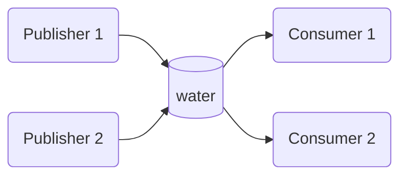
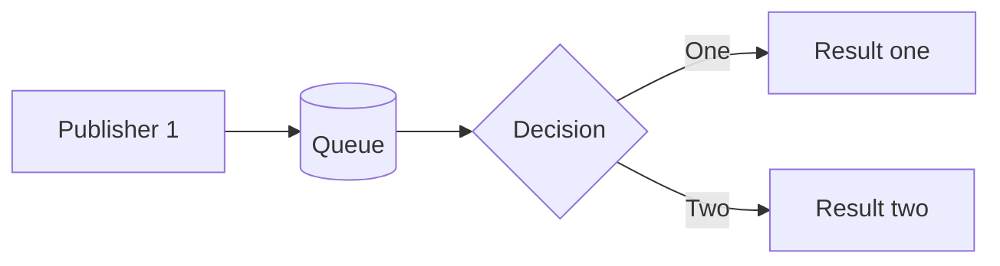

# Message Queue example

This example demonstrates message queue pattern using Redis implementation of IMessageBus in `yaaf-common` package.
The example initializes two publishers writing messages to the queue and two subscribers pulling these messages

### Message Queue pattern
In a message queue, many publishers can publish (send) a message to a queue and many subscribers can pull messages from a queue.
A message is processed *only once*, it is picked up by a subscriber and removed from the queue.






To run this example:

```shell
go run .
```