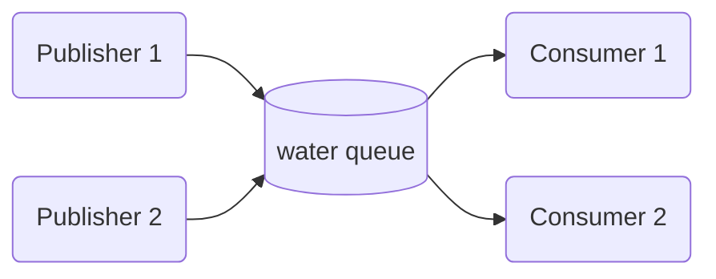

# Redis Message Queue Example

This example demonstrates the message queue pattern using the Redis implementation of the `IMessageBus` interface from the `yaaf-common` package. It sets up a scenario with multiple publishers and consumers interacting with a shared message queue.

## Overview

The message queue pattern is a fundamental concept in building distributed systems. It allows for asynchronous communication between different parts of an application or between different microservices. In this pattern:

- **Publishers** send messages to a specific queue.
- **Consumers** (or subscribers) retrieve messages from the queue to process them.

A key characteristic of the message queue pattern is that each message is processed by **only one** consumer, even if multiple consumers are listening on the same queue. This makes it ideal for distributing tasks, load balancing, and ensuring that each message is handled exactly once.

### Flow Diagram

The following diagram illustrates the flow of messages in this example:



## How It Works

This example consists of the following components:

- **`main.go`**: The entry point of the application. It initializes and runs a Redis container, and then starts two publishers and two consumers.
- **`publisher.go`**: Defines a `RedisPublisher` that sends `WaterMetric` messages to a specified queue at a regular interval.
- **`consumer.go`**: Defines a `RedisConsumer` that listens for messages on a specified queue and processes them.
- **`model.go`**: Contains the `WaterMetric` struct, which is the data model for the messages being sent.

### The `yaaf-common-redis` Integration

This example leverages the `yaaf-common-redis` package, which provides a Redis-based implementation of the `IMessageBus` interface from `yaaf-common`. Here's how it's used:

1. **Redis Container**: Run the `docker-compose.yml` file in the `examples` directory to start a Redis container. This provides the necessary Redis instance for the message bus.

2. **Message Bus Creation**: Both the publisher and consumer create an instance of the Redis message bus by calling `redis.NewRedisMessageBus(redisUri)`.

3. **Publishing Messages**: The `RedisPublisher` uses the `Push` method of the message bus to send messages to the "water" queue. The `Push` method is the standard way to send messages in a queueing pattern.

4. **Consuming Messages**: The `RedisConsumer` uses the `Pop` method of the message bus to retrieve messages from the "water" queue. The `Pop` method is a blocking call that waits for a message to be available on the queue and then returns it. This ensures that each message is processed by only one consumer.

## Running the Example

To run this example, you need to have Docker installed and running on your system.

1. **Navigate to the example directory**:
   ```shell
   cd examples/message_queue
   ```

2. **Run the application**:
   ```shell
   go run .
   ```

You will see log output from the publishers sending messages and the consumers receiving and processing them. You can observe that each message is consumed by only one of the two consumers, demonstrating the core principle of the message queue pattern.
