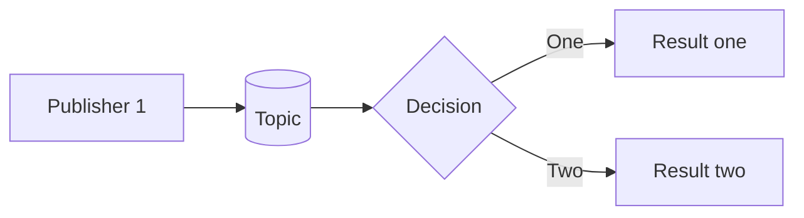

# Message PubSub example

This example demonstrates publish/subscribe messaging pattern using Redis implementation of IMessageBus in `yaaf-common` package.
The example initializes one publisher publishing messages to a topic and two subscribers processing these messages

### PubSub Messaging pattern
In a publish/subscribe pattern, many publishers can publish a message to a topic (channel) and many subscribers can subscribe 
to a topic and process messages. In this pattern the same message can be processed multiple times.
Every subscriber subscribed to the same topic will get the message and can process it.

In this example we will create a subscriber sending status messages and two subscribers will process the messages:
* one subscriber prints the values
* second subscriber generate aggregated values per time window





To run this example:

```shell
go run .
```