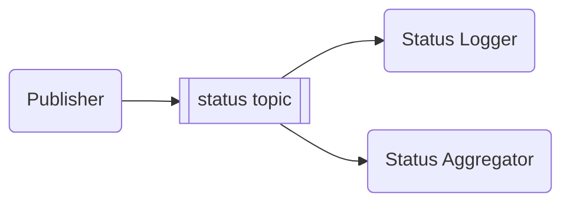

# Pub/Sub Example

This example demonstrates the publish-subscribe messaging pattern using the `yaaf-common-redis` library. It showcases how to create a Redis-backed message bus, publish messages to a topic, and process them with multiple subscribers.

## Overview

The example consists of the following components:

- **Publisher**: Publishes status messages to the `status` topic every 500 milliseconds.
- **Logger Subscriber**: Subscribes to the `status` topic and logs the received messages.
- **Aggregator Subscriber**: Subscribes to the `status` topic, aggregates the messages, and prints a summary every 5 seconds.

This example highlights the following features of the `yaaf-common-redis` library:

- **`NewRedisMessageBus`**: Creates a new message bus instance connected to a Redis server.
- **`IMessageBus` Interface**: Defines the core functionality for publishing and subscribing to messages.
- **`Ping`**: Verifies the connection to the Redis instance.

## How it Works

The `main` function in `main.go` orchestrates the example:

1. **Initialization**: It initializes a new `RedisMessageBus` instance using the provided Redis URI.
2. **Connection**: It pings the Redis server to ensure a successful connection.
3. **Publisher**: It creates and starts a `StatusPublisher` that sends messages to the `status` topic.
4. **Subscribers**: It creates and starts two subscribers:
    - `StatusLogger`: Logs each message it receives.
    - `StatusAggregator`: Collects and aggregates messages, printing a summary at regular intervals.

The program runs for one minute, demonstrating the real-time nature of the pub/sub pattern.



## Running the Example

To run this example, make sure you have a Redis instance running and accessible at `redis://localhost:6379`.

Then, execute the following command:

```shell
go run .
```
